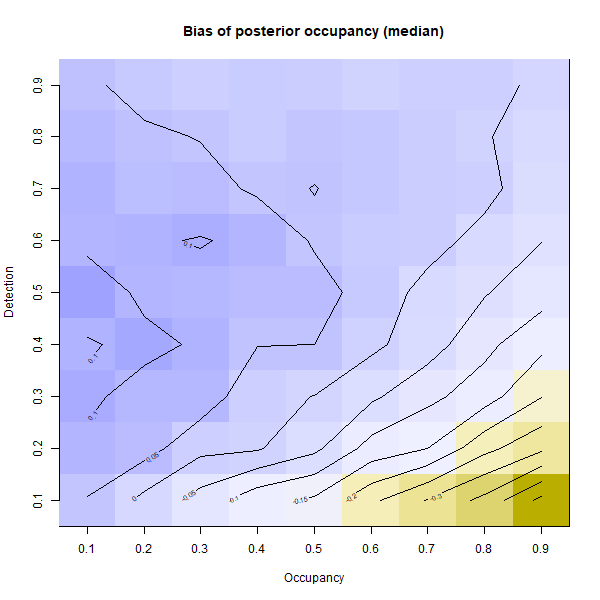
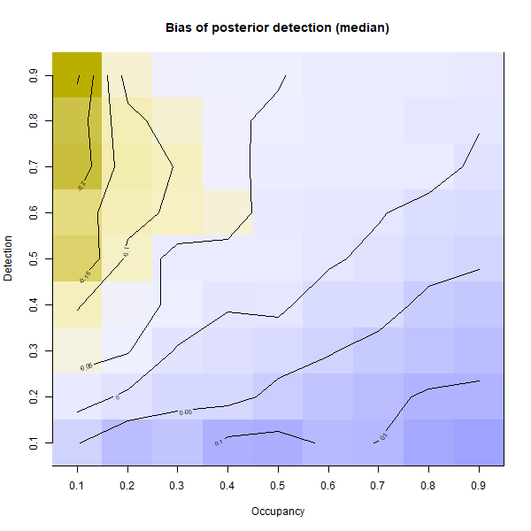
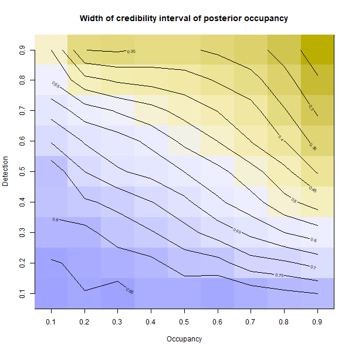
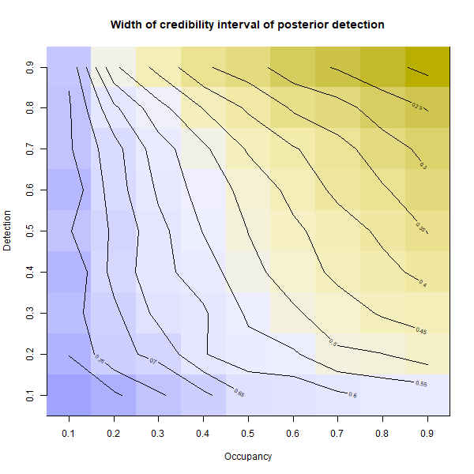

## Thursday, December 17

I worked on simulations using the Slikok project sample frame.

```r
## Script to start simulating data comparable to the Slikok arthropod dataset.

## Load libraries.
#library(unmarked)
#library(AHMbook)
library(maptools)
#library(rgdal)
library(raster)
library(jagsUI)
library(MCMCglmm)

## Load functions.
source("functions/functions.R")

## Load data.
load("../data/final_data/geodata/2020-12-16-1026_plot_circles.RData")
load("../data/final_data/geodata/2020-12-16-1026_subplot_semicircles.RData")


## Now run some simulations.
## Basing an initial simulation on Kery and Royle (2016), p. 561.

#set.seed(2015)
M <- 40 ## Number of sites.
J <- 2 ## Number of visits.
y <- matrix(NA, nrow=M, ncol=J)
psi <- 0.5 ## Probability of occurrence on 100 m2 plot.
p <- 0.5 ## Probability of detection on 50 m2 subplot given presence on the larger 100 m2 plot.

## Generate presence/absence data.
z <- rbinom(n=M, size=1, prob=psi) ## Realizations of occurrence.

## Generate detection/nondetection data.
for (j in 1:J)
 {
 y[,j] <- rbinom(n=M, size=1, prob=z*p)
 } 
 
## Now insert NA values for our worst case, in the later sampling. 
y[,2][plotsdf$west_2==0] <- NA

## Now run model.
str(win.data <- list(y=y, M=M, J=J))

## Specify model in BUGS language.
sink("2020-12-17-0623_model.txt")
cat("
model {
# Priors
 psi ~ dunif(0,1)
 p ~ dunif(0,1)
# Likelihood
for (i in 1:M) {
 z[i] ~ dbern(psi)
 for (j in 1:J) {
  y[i,j] ~ dbern(z[i]*p)
  }
 } 
 }
", fill=TRUE)
sink()

## Initial values.
zst <- apply(y, 1, max, na.rm=TRUE)
inits <- function(){list(z=zst)}

## Parameters monitored
params <- c("psi", "p")

## MCMC settings.
ni <- 5000; nt <- 1; nb <- 1000; nc <- 3

## Call JAGS and summarize posteriors.
fm2 <- jags(win.data,
 inits,
 params,
 "2020-12-17-0623_model.txt",
 n.chains=nc,
 n.thin=nt,
 n.iter=ni,
 n.burnin=nb
 )

print(fm2, dig=3)

fm2$summary[1,1] ## mean of posterior of psi.
fm2$summary[2,1] ## mean of posterior of p.

## That worked. Now I want to put this into a loop to simulate over a number of values of psi and p.
## Using example from Kery and Royle (2016), p. 585.
simreps <- 100 ## Number of simulations per parameter combination.
psi <- c(0.25, 0.5, 0.75) ## Values of psi to simulate.
p <- c(0.25, 0.5, 0.75) ## Values of p to simulate.
est <- array(dim=c(2, simreps, length(psi), length(p)))

system.time(
for (this_psi in 1:length(psi))
 {
 for (this_p in 1:length(p))
  {
  for (this_sim in 1:simreps)
   {
   ## Counter.
   cat("psi", this_psi, "p", this_p, "simulation", this_sim)   
   ## Generate presence/absence data.
   z <- rbinom(n=M, size=1, prob=psi[this_psi]) ## Realizations of occurrence.
   ## Generate detection/nondetection data.  
   for (j in 1:J)
    {
    y[,j] <- rbinom(n=M, size=1, prob=z*p[this_p])
    } 
   ## Insert NAs for sites sampled only once. 
   y[,2][plotsdf$west_2==0] <- NA
   ## Now run model.
   str(win.data <- list(y=y, M=M, J=J))
   ## Initial values.
   zst <- apply(y, 1, max, na.rm=TRUE)
   inits <- function(){list(z=zst)}
   ## Parameters monitored
   params <- c("psi", "p")
   ## MCMC settings.
   ni <- 5000; nt <- 1; nb <- 1000; nc <- 3
   ## Call JAGS and summarize posteriors.
   fm2 <- jags(win.data,
    inits,
    params,
    "2020-12-17-0623_model.txt",
    n.chains=nc,
    n.thin=nt,
    n.iter=ni,
    n.burnin=nb
    )
   ## Save results.
   est[1,this_sim,this_psi,this_p] <- fm2$summary[1,1]
   est[2,this_sim,this_psi,this_p] <- fm2$summary[2,1]
   }
  }
 }
)
Done. 
   user  system elapsed 
 605.01  217.50  864.67 
 
## Saving results.
save(est, file=paste0("../data/final_data/occupancy/", nowstring(), "_simulation_results.RData"))
 
apply(est, c(1,3,4), mean)[1,,] ## Mean of occupany estimates.
          [,1]      [,2]      [,3]
[1,] 0.3492666 0.3872328 0.3328860
[2,] 0.5137620 0.5787247 0.5510909
[3,] 0.6056848 0.7450027 0.7605675

apply(est, c(1,3,4), mean)[2,,] ## Mean of detection estimates.
          [,1]      [,2]      [,3]
[1,] 0.2904360 0.4253303 0.6433866
[2,] 0.3120522 0.4911155 0.7017536
[3,] 0.3557997 0.5226965 0.7221067

## It may be useful to look at more than the mean, but also the median and mode of the posterior distributions.

simreps <- 100 ## Number of simulations per parameter combination.
psi <- c(0.25, 0.5, 0.75) ## Values of psi to simulate.
p <- c(0.25, 0.5, 0.75) ## Values of p to simulate.
est <- array(dim=c(2, 8, simreps, length(psi), length(p)))

system.time(
for (this_psi in 1:length(psi))
 {
 for (this_p in 1:length(p))
  {
  for (this_sim in 1:simreps)
   {
   ## Counter.
   cat("psi", this_psi, "p", this_p, "simulation", this_sim)   
   ## Generate presence/absence data.
   z <- rbinom(n=M, size=1, prob=psi[this_psi]) ## Realizations of occurrence.
   ## Generate detection/nondetection data.  
   for (j in 1:J)
    {
    y[,j] <- rbinom(n=M, size=1, prob=z*p[this_p])
    } 
   ## Insert NAs for sites sampled only once. 
   y[,2][plotsdf$west_2==0] <- NA
   ## Now run model.
   str(win.data <- list(y=y, M=M, J=J))
   ## Initial values.
   zst <- apply(y, 1, max, na.rm=TRUE)
   inits <- function(){list(z=zst)}
   ## Parameters monitored
   params <- c("psi", "p")
   ## MCMC settings.
   ni <- 5000; nt <- 1; nb <- 1000; nc <- 1
   ## Call JAGS and summarize posteriors.
   fm2 <- jags(win.data,
    inits,
    params,
    "2020-12-17-0623_model.txt",
    n.chains=nc,
    n.thin=nt,
    n.iter=ni,
    n.burnin=nb
    )
   ## Save results.
   est[,1:7,this_sim,this_psi,this_p] <- fm2$summary[1:2,1:7]
   ## Calculate posterior modes.
   fmm <- mcmc(fm2$samples[[1]])
   est[,8,this_sim,this_psi,this_p] <- posterior.mode(fmm)[1:2]
   }
  }
 }
)

## Labelling the output to make it more clear.
dimnames(est) <- list(
 variable=c("psi", "p"),
 statistic=c(colnames(fm2$summary)[1:7], "mode"),
 simulation=1:simreps,
 psi=psi,
 p=p
 )

## Saving results.
save(est, file=paste0("../data/final_data/occupancy/", nowstring(), "_simulation_results.RData")) 
## Look at means of means of posterior occupancy.
apply(est[1,1,,,], c(2,3), mean)
      p
psi         0.25       0.5      0.75
  0.25 0.3680324 0.3873789 0.3219284
  0.5  0.5103392 0.5520909 0.5534798
  0.75 0.6178478 0.7361721 0.7668021
## Look at means of medians of posterior occupancy.
apply(est[1,5,,,], c(2,3), mean)
      p
psi         0.25       0.5      0.75
  0.25 0.3114534 0.3455161 0.3005715
  0.5  0.4828366 0.5365958 0.5443038
  0.75 0.6113276 0.7383535 0.7685945
## Look at means of modes of posterior occupancy.
apply(est[1,8,,,], c(2,3), mean)
      p
psi         0.25       0.5      0.75
  0.25 0.1923107 0.2610505 0.2700981
  0.5  0.4157273 0.5056128 0.5325003
  0.75 0.6079352 0.7561029 0.7731524
## Look at means of means of posterior detection.
apply(est[2,1,,,], c(2,3), mean)
      p
psi         0.25       0.5      0.75
  0.25 0.3137103 0.4270094 0.6604537
  0.5  0.3139346 0.4812764 0.6941119
  0.75 0.3347033 0.5164870 0.7238118
## Look at means of medians of posterior detection.
apply(est[2,5,,,], c(2,3), mean)
      p
psi         0.25       0.5      0.75
  0.25 0.2710764 0.4110953 0.6766562
  0.5  0.2863690 0.4748901 0.7038914
  0.75 0.3164527 0.5128677 0.7287297
## Look at means of modes of posterior detection.
apply(est[2,8,,,], c(2,3), mean)  
      p
psi         0.25       0.5      0.75
  0.25 0.2027999 0.3703367 0.7169579
  0.5  0.2253313 0.4578294 0.7270636
  0.75 0.2754854 0.5031303 0.7390812

## Now trying more values of psi and p.

simreps <- 100 ## Number of simulations per parameter combination.
psi <- (1:9)/10 ## Values of psi to simulate.
p <- (1:9)/10 ## Values of p to simulate.
est <- array(dim=c(2, 8, simreps, length(psi), length(p)))

et <- system.time(
for (this_psi in 1:length(psi))
 {
 for (this_p in 1:length(p))
  {
  for (this_sim in 1:simreps)
   {
   ## Counter.
   cat("psi", this_psi, "p", this_p, "simulation", this_sim)   
   ## Generate presence/absence data.
   z <- rbinom(n=M, size=1, prob=psi[this_psi]) ## Realizations of occurrence.
   ## Generate detection/nondetection data.  
   for (j in 1:J)
    {
    y[,j] <- rbinom(n=M, size=1, prob=z*p[this_p])
    } 
   ## Insert NAs for sites sampled only once. 
   y[,2][plotsdf$west_2==0] <- NA
   ## Now run model.
   str(win.data <- list(y=y, M=M, J=J))
   ## Initial values.
   zst <- apply(y, 1, max, na.rm=TRUE)
   inits <- function(){list(z=zst)}
   ## Parameters monitored
   params <- c("psi", "p")
   ## MCMC settings.
   ni <- 5000; nt <- 1; nb <- 1000; nc <- 1
   ## Call JAGS and summarize posteriors.
   fm2 <- jags(win.data,
    inits,
    params,
    "2020-12-17-0623_model.txt",
    n.chains=nc,
    n.thin=nt,
    n.iter=ni,
    n.burnin=nb
    )
   ## Save results.
   est[,1:7,this_sim,this_psi,this_p] <- fm2$summary[1:2,1:7]
   ## Calculate posterior modes.
   fmm <- mcmc(fm2$samples[[1]])
   est[,8,this_sim,this_psi,this_p] <- posterior.mode(fmm)[1:2]
   }
  }
 }
)
et
   user  system elapsed 
1921.52 1424.35 3416.00 

## Labelling the output to make it more clear.
dimnames(est) <- list(
 variable=c("psi", "p"),
 statistic=c(colnames(fm2$summary)[1:7], "mode"),
 simulation=1:simreps,
 psi=psi,
 p=p
 )

## Saving results.
save(est, file=paste0("../data/final_data/occupancy/", nowstring(), "_simulation_results.RData")) 

## Look at estimates.
apply(est[1,1,,,], c(2,3), mean)  
apply(est[1,5,,,], c(2,3), mean)  
apply(est[1,8,,,], c(2,3), mean)  
apply(est[2,1,,,], c(2,3), mean)  
apply(est[2,5,,,], c(2,3), mean)  
apply(est[2,8,,,], c(2,3), mean)  

## bias.
psi_true <- matrix(psi, nrow=length(psi), ncol=length(p), byrow = FALSE)
p_true <- matrix(p, nrow=length(psi), ncol=length(p), byrow = TRUE)

# occupancy, posterior mean
image_file <- paste0("../documents/images/", nowstring(), "_bias_psi_mean.png")
width <- 600
png(filename=image_file,
 width=width,
 height=round(width),
 pointsize=12
 )
image(apply(est[1,1,,,], c(2,3), mean) - psi_true,
 xaxt="n",
 yaxt="n",
 main="Bias of posterior occupancy (mean)",
 xlab="Occupancy",
 ylab="Detection",
 col = hcl.colors(100, "Blue-Yellow 3", rev = TRUE)
 )
axis(side=1,
 at=(0:(length(psi)-1))/(length(psi)-1),
 labels=psi
 )
axis(side=2,
 at=(0:(length(p)-1))/(length(p)-1),
 labels=p
 ) 
contour(apply(est[1,1,,,], c(2,3), mean) - psi_true,
 add=TRUE
 )
dev.off() 
 
# occupancy, posterior median
image_file <- paste0("../documents/images/", nowstring(), "_bias_psi_median.png")
width <- 600
png(filename=image_file,
 width=width,
 height=round(width),
 pointsize=12
 )
image(apply(est[1,5,,,], c(2,3), mean) - psi_true,
 xaxt="n",
 yaxt="n",
 main="Bias of posterior occupancy (median)",
 xlab="Occupancy",
 ylab="Detection",
 col = hcl.colors(100, "Blue-Yellow 3", rev = TRUE)
 )
axis(side=1,
 at=(0:(length(psi)-1))/(length(psi)-1),
 labels=psi
 )
axis(side=2,
 at=(0:(length(p)-1))/(length(p)-1),
 labels=p
 ) 
contour(apply(est[1,5,,,], c(2,3), mean) - psi_true,
 add=TRUE
 )
dev.off() 
 
# occupancy, posterior mode
image_file <- paste0("../documents/images/", nowstring(), "_bias_psi_mode.png")
width <- 600
png(filename=image_file,
 width=width,
 height=round(width),
 pointsize=12
 )
image(apply(est[1,8,,,], c(2,3), mean) - psi_true,
 xaxt="n",
 yaxt="n",
 main="Bias of posterior occupancy (mode)",
 xlab="Occupancy",
 ylab="Detection",
 col = hcl.colors(100, "Blue-Yellow 3", rev = TRUE)
 )
axis(side=1,
 at=(0:(length(psi)-1))/(length(psi)-1),
 labels=psi
 )
axis(side=2,
 at=(0:(length(p)-1))/(length(p)-1),
 labels=p
 ) 
contour(apply(est[1,8,,,], c(2,3), mean) - psi_true,
 add=TRUE
 )
dev.off() 
 
# detection, posterior mean
image_file <- paste0("../documents/images/", nowstring(), "_bias_p_mean.png")
width <- 600
png(filename=image_file,
 width=width,
 height=round(width),
 pointsize=12
 )
image(apply(est[2,1,,,], c(2,3), mean) - p_true,
 xaxt="n",
 yaxt="n",
 main="Bias of posterior detection (mean)",
 xlab="Occupancy",
 ylab="Detection",
 col = hcl.colors(100, "Blue-Yellow 3", rev = TRUE)
 )
axis(side=1,
 at=(0:(length(psi)-1))/(length(psi)-1),
 labels=psi
 )
axis(side=2,
 at=(0:(length(p)-1))/(length(p)-1),
 labels=p
 ) 
contour(apply(est[2,1,,,], c(2,3), mean) - p_true,
 add=TRUE
 )
dev.off() 
 
# detection, posterior median
image_file <- paste0("../documents/images/", nowstring(), "_bias_p_median.png")
width <- 600
png(filename=image_file,
 width=width,
 height=round(width),
 pointsize=12
 )
image(apply(est[2,5,,,], c(2,3), mean) - p_true,
 xaxt="n",
 yaxt="n",
 main="Bias of posterior detection (median)",
 xlab="Occupancy",
 ylab="Detection",
 col = hcl.colors(100, "Blue-Yellow 3", rev = TRUE)
 )
axis(side=1,
 at=(0:(length(psi)-1))/(length(psi)-1),
 labels=psi
 )
axis(side=2,
 at=(0:(length(p)-1))/(length(p)-1),
 labels=p
 ) 
contour(apply(est[2,5,,,], c(2,3), mean) - p_true,
 add=TRUE
 )
dev.off() 
  
# detection, posterior mode
image_file <- paste0("../documents/images/", nowstring(), "_bias_p_mode.png")
width <- 600
png(filename=image_file,
 width=width,
 height=round(width),
 pointsize=12
 )
image(apply(est[2,8,,,], c(2,3), mean) - p_true,
 xaxt="n",
 yaxt="n",
 main="Bias of posterior detection (mode)",
 xlab="Occupancy",
 ylab="Detection",
 col = hcl.colors(100, "Blue-Yellow 3", rev = TRUE)
 )
axis(side=1,
 at=(0:(length(psi)-1))/(length(psi)-1),
 labels=psi
 )
axis(side=2,
 at=(0:(length(p)-1))/(length(p)-1),
 labels=p
 ) 
contour(apply(est[2,8,,,], c(2,3), mean) - p_true,
 add=TRUE
 )
dev.off() 
  
## Now I want some overall summaries of bias.

## Overall mean absolute value of bias, posterior mean of occupancy.
mean(abs(apply(est[1,1,,,], c(2,3), mean) - psi_true)) 
[1] 0.09148218

## Overall mean absolute value of bias, posterior median of occupancy.
mean(abs(apply(est[1,5,,,], c(2,3), mean) - psi_true))
[1] 0.07805228 

## Overall mean absolute value of bias, posterior mode of occupancy.
mean(abs(apply(est[1,8,,,], c(2,3), mean) - psi_true)) 
[1] 0.0750045

## So the mode was least biased overall.

mean((apply(est[1,1,,,], c(2,3), mean) - psi_true))
[1] 0.01453946 ## mean tended to be biased high.
mean((apply(est[1,5,,,], c(2,3), mean) - psi_true))
[1] -0.01002125 ## median is not very biased directionally.
mean((apply(est[1,8,,,], c(2,3), mean) - psi_true))
[1] -0.05454094 ## mode was biased low.
## It looks like the median is the best to use because the absolute value of bias is almost as good as the mode while the overall tendency of the bias is pretty much right on.

## Overall mean absolute value of bias, detection
mean(abs(apply(est[2,1,,,], c(2,3), mean) - p_true))
[1] 0.07519505 
mean(abs(apply(est[2,5,,,], c(2,3), mean) - p_true))
[1] 0.06370208
mean(abs(apply(est[2,8,,,], c(2,3), mean) - p_true)) 
[1] 0.05298871
## Again, absolute value of mode is least biased.

mean((apply(est[2,1,,,], c(2,3), mean) - p_true))
[1] 0.001989022
mean((apply(est[2,5,,,], c(2,3), mean) - p_true))
[1] -0.01202235
mean((apply(est[2,8,,,], c(2,3), mean) - p_true))
[1] -0.03307226
## Mode is least systematically biased.

## I am also interested in the width of the credibility intervals.

apply(est[1,7,,,]-est[1,2,,,], c(2,3), mean)

# occupancy, credibility interval width
image_file <- paste0("../documents/images/", nowstring(), "_psi_ci_width.png")
width <- 600
png(filename=image_file,
 width=width,
 height=round(width),
 pointsize=12
 )
image(apply(est[1,7,,,]-est[1,3,,,], c(2,3), mean),
 xaxt="n",
 yaxt="n",
 main="Width of credibility interval of posterior occupancy",
 xlab="Occupancy",
 ylab="Detection",
 col = hcl.colors(100, "Blue-Yellow 3", rev = TRUE)
 )
axis(side=1,
 at=(0:(length(psi)-1))/(length(psi)-1),
 labels=psi
 )
axis(side=2,
 at=(0:(length(p)-1))/(length(p)-1),
 labels=p
 ) 
contour(apply(est[1,7,,,]-est[1,3,,,], c(2,3), mean),
 add=TRUE
 )
dev.off() 

# detection, credibility interval width
image_file <- paste0("../documents/images/", nowstring(), "_p_ci_width.png")
width <- 600
png(filename=image_file,
 width=width,
 height=round(width),
 pointsize=12
 )
image(apply(est[2,7,,,]-est[2,3,,,], c(2,3), mean),
 xaxt="n",
 yaxt="n",
 main="Width of credibility interval of posterior detection",
 xlab="Occupancy",
 ylab="Detection",
 col = hcl.colors(100, "Blue-Yellow 3", rev = TRUE)
 )
axis(side=1,
 at=(0:(length(psi)-1))/(length(psi)-1),
 labels=psi
 )
axis(side=2,
 at=(0:(length(p)-1))/(length(p)-1),
 labels=p
 ) 
contour(apply(est[2,7,,,]-est[2,3,,,], c(2,3), mean),
 add=TRUE
 )
dev.off() 
```

Bias of estimates of occupancy (*ψ*) was minor (absolute value of bias < 0.05) whenever detection probability (*p*) was > 0.8 and whenever the values of *ψ* and *p* were similar.

\
Bias of estimates of occupancy (*ψ*) from 100 simulations at 9 values of *ψ* and detection probability (*p*). Values in the graph are the true values of *ψ* subtracted from the means of the 100 median values of the posterior distributions of *ψ*.

Bias of estimates of *p* had small absolute values (< 0.05) when *ψ* was > 0.4 and *p* was > 0.4.

\
Bias of estimates of detection (*p*) from 100 simulations at 9 values of occupancy (*ψ*) and *p*. Values in the graph are the true values of *p* subtracted from the means of the 100 median values of the posterior distributions of *p*.

\
Widths of 95% credibility intervals of occupancy (*ψ*) from 100 simulations at 9 values of *ψ* and detection probability (*p*). 

\
Widths of credibility intervals of detection (*p*) from 100 simulations at 9 values of occupancy (*ψ*) and *p*.

By studying these graphs, it appears that the part of parameter space where estiamtes are pretty good is the upper right half of the graph, where both *ψ* and *p* are high. From the perspective of anaylizing real data, when the true values of *ψ* and *p* are not known, the best way to assess this would be to examine the widths of the credibility intervals. If the widths or < 0.5 or so, then the estimates should be pretty unbiased. 

I started a new set of simulations, this time with 1000 simulations per combination of occupancy and detection.

```r
## Script to start simulating data comparable to the Slikok arthropod dataset.

## Load libraries.
#library(unmarked)
#library(AHMbook)
library(maptools)
#library(rgdal)
library(raster)
library(jagsUI)
library(MCMCglmm)

## Load functions.
source("functions/functions.R")

## Load data.
load("../data/final_data/geodata/2020-12-16-1026_plot_circles.RData")
load("../data/final_data/geodata/2020-12-16-1026_subplot_semicircles.RData")

## Now trying higher numbers of simulations.
M <- 40 ## Number of sites.
J <- 2 ## Number of visits.
y <- matrix(NA, nrow=M, ncol=J)
simreps <- 1000 ## Number of simulations per parameter combination.
psi <- (1:9)/10 ## Values of psi to simulate.
p <- (1:9)/10 ## Values of p to simulate.
est <- array(dim=c(2, 8, simreps, length(psi), length(p)))

et <- system.time(
for (this_psi in 1:length(psi))
 {
 for (this_p in 1:length(p))
  {
  for (this_sim in 1:simreps)
   {
   ## Counter.
   cat("psi", this_psi, "p", this_p, "simulation", this_sim)   
   ## Generate presence/absence data.
   z <- rbinom(n=M, size=1, prob=psi[this_psi]) ## Realizations of occurrence.
   ## Generate detection/nondetection data.  
   for (j in 1:J)
    {
    y[,j] <- rbinom(n=M, size=1, prob=z*p[this_p])
    } 
   ## Insert NAs for sites sampled only once. 
   y[,2][plotsdf$west_2==0] <- NA
   ## Now run model.
   str(win.data <- list(y=y, M=M, J=J))
   ## Initial values.
   zst <- apply(y, 1, max, na.rm=TRUE)
   inits <- function(){list(z=zst)}
   ## Parameters monitored
   params <- c("psi", "p")
   ## MCMC settings.
   ni <- 5000; nt <- 1; nb <- 1000; nc <- 1
   ## Call JAGS and summarize posteriors.
   fm2 <- jags(win.data,
    inits,
    params,
    "2020-12-17-0623_model.txt",
    n.chains=nc,
    n.thin=nt,
    n.iter=ni,
    n.burnin=nb
    )
   ## Save results.
   est[,1:7,this_sim,this_psi,this_p] <- fm2$summary[1:2,1:7]
   ## Calculate posterior modes.
   fmm <- mcmc(fm2$samples[[1]])
   est[,8,this_sim,this_psi,this_p] <- posterior.mode(fmm)[1:2]
   }
  }
 }
)
et

## Labelling the output to make it more clear.
dimnames(est) <- list(
 variable=c("psi", "p"),
 statistic=c(colnames(fm2$summary)[1:7], "mode"),
 simulation=1:simreps,
 psi=psi,
 p=p
 )

## Saving results.
save(est, file=paste0("../data/final_data/occupancy/", nowstring(), "_simulation_results.RData")) 
```