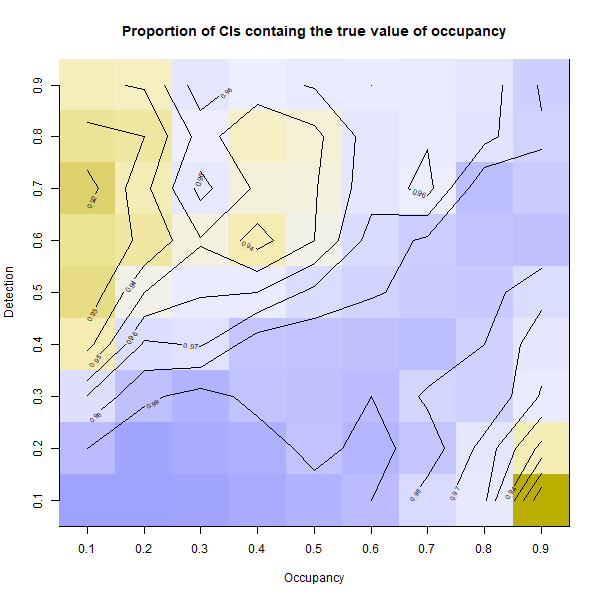
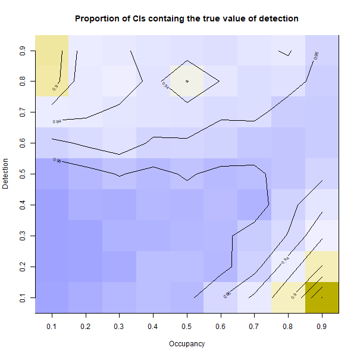

## Friday, December 18

The simulations I had started last night finished this morning. I examined the results. The graphs of bias, etc. looked much like the ones I had made yesterday.

```r
## Script to start simulating data comparable to the Slikok arthropod dataset.

## Load libraries.
library(maptools)
library(raster)
library(jagsUI)
library(MCMCglmm)

## Load functions.
source("functions/functions.R")

## Load data.
load("../data/final_data/occupancy/2020-12-18-0849_simulation_results.RData") 

## Look at estimates.
apply(est[1,1,,,], c(2,3), mean)  
apply(est[1,5,,,], c(2,3), mean)  
apply(est[1,8,,,], c(2,3), mean)  
apply(est[2,1,,,], c(2,3), mean)  
apply(est[2,5,,,], c(2,3), mean)  
apply(est[2,8,,,], c(2,3), mean)  

## Comparing taking means and medians.
apply(est[1,5,,,], c(2,3), mean)
apply(est[1,5,,,], c(2,3), median)
## The medians may be a little better metric. They appear to be less biased.

## bias.
psi <- (1:9)/10 
p <- (1:9)/10 
psi_true <- matrix(psi, nrow=length(psi), ncol=length(p), byrow = FALSE)
p_true <- matrix(p, nrow=length(psi), ncol=length(p), byrow = TRUE)

# occupancy, posterior median
image_file <- paste0("../documents/images/", nowstring(), "_bias_psi_median.png")
width <- 600
png(filename=image_file,
 width=width,
 height=round(width),
 pointsize=12
 )
image(apply(est[1,5,,,], c(2,3), median) - psi_true,
 xaxt="n",
 yaxt="n",
 main="Bias of posterior occupancy (median)",
 xlab="Occupancy",
 ylab="Detection",
 col = hcl.colors(100, "Blue-Yellow 3", rev = TRUE)
 )
axis(side=1,
 at=(0:(length(psi)-1))/(length(psi)-1),
 labels=psi
 )
axis(side=2,
 at=(0:(length(p)-1))/(length(p)-1),
 labels=p
 ) 
contour(apply(est[1,5,,,], c(2,3), median) - psi_true,
 add=TRUE
 )
dev.off() 

# detection, posterior median
image_file <- paste0("../documents/images/", nowstring(), "_bias_p_median.png")
width <- 600
png(filename=image_file,
 width=width,
 height=round(width),
 pointsize=12
 )
image(apply(est[2,5,,,], c(2,3), median) - p_true,
 xaxt="n",
 yaxt="n",
 main="Bias of posterior detection (median)",
 xlab="Occupancy",
 ylab="Detection",
 col = hcl.colors(100, "Blue-Yellow 3", rev = TRUE)
 )
axis(side=1,
 at=(0:(length(psi)-1))/(length(psi)-1),
 labels=psi
 )
axis(side=2,
 at=(0:(length(p)-1))/(length(p)-1),
 labels=p
 ) 
contour(apply(est[2,5,,,], c(2,3), median) - p_true,
 add=TRUE
 )
dev.off() 

## It would be nice just to see the estimates, also.

# occupancy, posterior median
image_file <- paste0("../documents/images/", nowstring(), "_psi_median.png")
width <- 600
png(filename=image_file,
 width=width,
 height=round(width),
 pointsize=12
 )
image(apply(est[1,5,,,], c(2,3), median),
 xaxt="n",
 yaxt="n",
 main="Median of posterior occupancy",
 xlab="Occupancy",
 ylab="Detection",
 col = hcl.colors(100, "Blue-Yellow 3", rev = TRUE)
 )
axis(side=1,
 at=(0:(length(psi)-1))/(length(psi)-1),
 labels=psi
 )
axis(side=2,
 at=(0:(length(p)-1))/(length(p)-1),
 labels=p
 ) 
contour(apply(est[1,5,,,], c(2,3), median),
 add=TRUE
 )
dev.off() 

# detection, posterior median
image_file <- paste0("../documents/images/", nowstring(), "_p_median.png")
width <- 600
png(filename=image_file,
 width=width,
 height=round(width),
 pointsize=12
 )
image(apply(est[2,5,,,], c(2,3), median),
 xaxt="n",
 yaxt="n",
 main="Median of posterior detection",
 xlab="Occupancy",
 ylab="Detection",
 col = hcl.colors(100, "Blue-Yellow 3", rev = TRUE)
 )
axis(side=1,
 at=(0:(length(psi)-1))/(length(psi)-1),
 labels=psi
 )
axis(side=2,
 at=(0:(length(p)-1))/(length(p)-1),
 labels=p
 ) 
contour(apply(est[2,5,,,], c(2,3), median),
 add=TRUE
 )
dev.off() 

# occupancy, credibility interval width
image_file <- paste0("../documents/images/", nowstring(), "_psi_ci_width.png")
width <- 600
png(filename=image_file,
 width=width,
 height=round(width),
 pointsize=12
 )
image(apply(est[1,7,,,]-est[1,3,,,], c(2,3), mean),
 xaxt="n",
 yaxt="n",
 main="Width of credibility interval of posterior occupancy",
 xlab="Occupancy",
 ylab="Detection",
 col = hcl.colors(100, "Blue-Yellow 3", rev = TRUE)
 )
axis(side=1,
 at=(0:(length(psi)-1))/(length(psi)-1),
 labels=psi
 )
axis(side=2,
 at=(0:(length(p)-1))/(length(p)-1),
 labels=p
 ) 
contour(apply(est[1,7,,,]-est[1,3,,,], c(2,3), mean),
 add=TRUE
 )
dev.off() 

# detection, credibility interval width
image_file <- paste0("../documents/images/", nowstring(), "_p_ci_width.png")
width <- 600
png(filename=image_file,
 width=width,
 height=round(width),
 pointsize=12
 )
image(apply(est[2,7,,,]-est[2,3,,,], c(2,3), mean),
 xaxt="n",
 yaxt="n",
 main="Width of credibility interval of posterior detection",
 xlab="Occupancy",
 ylab="Detection",
 col = hcl.colors(100, "Blue-Yellow 3", rev = TRUE)
 )
axis(side=1,
 at=(0:(length(psi)-1))/(length(psi)-1),
 labels=psi
 )
axis(side=2,
 at=(0:(length(p)-1))/(length(p)-1),
 labels=p
 ) 
contour(apply(est[2,7,,,]-est[2,3,,,], c(2,3), mean),
 add=TRUE
 )
dev.off() 

## How frequently is the true value contained within the 95% credibility interval?

simreps <- 1000
psiint <- array(dim=c(simreps, length(psi), length(p)))
for(this_rep in 1:simreps)
 {
 psiint[this_rep,,] <- (psi_true >= est[1,3,this_rep,,]) & (psi_true <= est[1,7,this_rep,,])
 }
psiint[,,] <- as.numeric(psiint[,,])
image_file <- paste0("../documents/images/", nowstring(), "_psi_in_CI.png")
width <- 600
png(filename=image_file,
 width=width,
 height=round(width),
 pointsize=12
 )
image(apply(psiint[,,], c(2,3), mean),
 xaxt="n",
 yaxt="n",
 main="Proportion of CIs containg the true value of occupancy",
 xlab="Occupancy",
 ylab="Detection",
 col = hcl.colors(100, "Blue-Yellow 3", rev = TRUE)
 )
axis(side=1,
 at=(0:(length(psi)-1))/(length(psi)-1),
 labels=psi
 )
axis(side=2,
 at=(0:(length(p)-1))/(length(p)-1),
 labels=p
 ) 
contour(apply(psiint[,,], c(2,3), mean),
 add=TRUE
 )
dev.off() 

pint <- array(dim=c(simreps, length(psi), length(p)))
for(this_rep in 1:simreps)
 {
 pint[this_rep,,] <- (p_true >= est[2,3,this_rep,,]) & (p_true <= est[2,7,this_rep,,])
 }
pint[,,] <- as.numeric(pint[,,])
image_file <- paste0("../documents/images/", nowstring(), "_p_in_CI.png")
width <- 600
png(filename=image_file,
 width=width,
 height=round(width),
 pointsize=12
 )
image(apply(pint[,,], c(2,3), mean),
 xaxt="n",
 yaxt="n",
 main="Proportion of CIs containg the true value of detection",
 xlab="Occupancy",
 ylab="Detection",
 col = hcl.colors(100, "Blue-Yellow 3", rev = TRUE)
 )
axis(side=1,
 at=(0:(length(psi)-1))/(length(psi)-1),
 labels=psi
 )
axis(side=2,
 at=(0:(length(p)-1))/(length(p)-1),
 labels=p
 ) 
contour(apply(pint[,,], c(2,3), mean),
 add=TRUE
 )
dev.off() 
```

\
Proportions of credibility intervals of *ψ* that contain the true value of *ψ* from 1000 simulations at 9 values of *ψ* and *p*.

\
Proportions of credibility intervals of *p* that contain the true value of *p* from 1000 simulations at 9 values of *ψ* and *p*.

