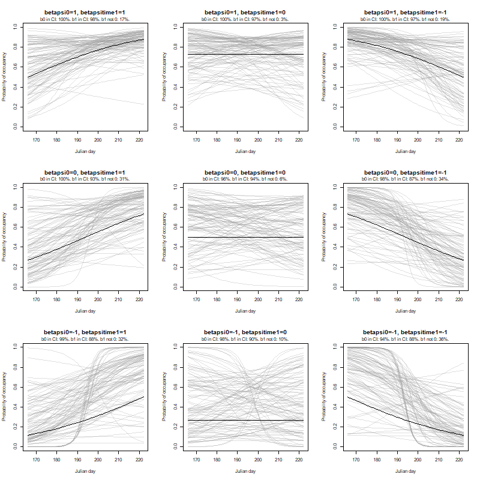
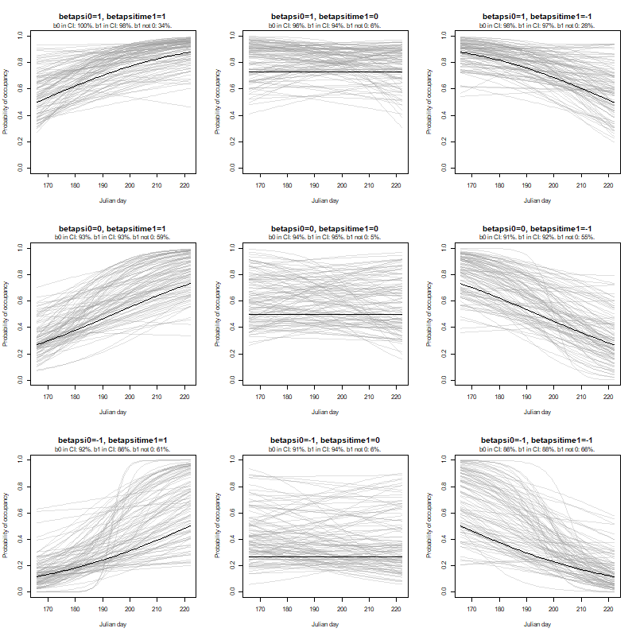
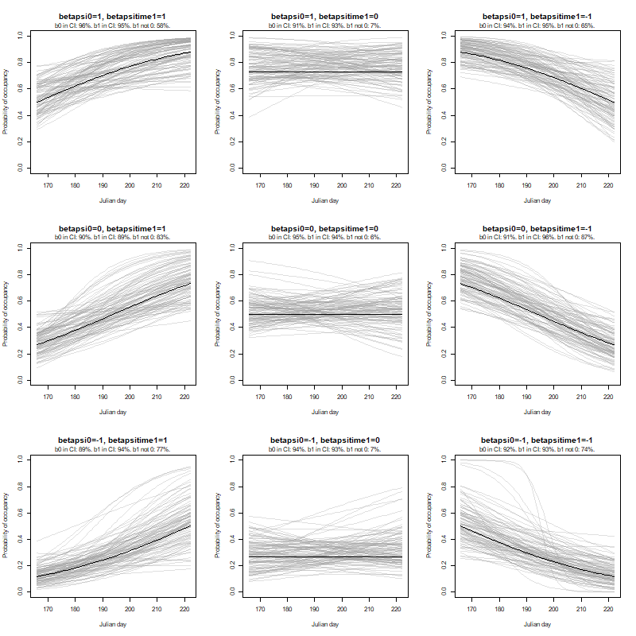

## Monday, December 28

To do

* ~~Lab clean-up / Collet specimen work with Jake~~
* ~~Elodea project aviation accounting~~
* ~~Inquire about birch field work~~

I uploaded @steer_invasive_2020 to ServCat.

I worked on examining results from my last occupancy simulations.

```r
## Examining results from last time.

## Load libraries.
library(jagsUI)
library(MCMCglmm)

## Load functions.
source("functions/functions.R")

## Load data.
load("../data/final_data/occupancy/2020-12-21-1521_simulation_results.RData")

## First I should look at what the values of beta actually mean in terms of occupancy.
betapsi0 <- c(-1, -1, -1, 0, 0, 0, 1, 1, 1)
betapsitime1 <- c(-1, 0, 1, -1, 0, 1, -1, 0, 1) 

## I am going to simulate data similar to these date ranges.
s1 <- as.numeric(format(as.Date("2016-06-14"), format="%j"))
e1 <- as.numeric(format(as.Date("2016-06-17"), format="%j"))
s2 <- as.numeric(format(as.Date("2016-07-18"), format="%j"))
e2 <- as.numeric(format(as.Date("2016-08-09"), format="%j"))

sample(s1:e1, 1)

## transformation
transtime <- function(x){
 (x - (s1+e2)/2)*2/(e2-s1)
 }

transtime(s1:e2)

image_file <- paste0("../documents/images/", nowstring(), "_psi_beta_actual.png")
width <- 600
png(filename=image_file,
 width=width,
 height=round(width),
 pointsize=12,
 antialias="cleartype"
 )
this_psi <- 1
par(mfrow = c(3, 3))
for (this_psi in rev(1:length(betapsi0)))
 {
plot(s1:e2,
 plogis(betapsi0[this_psi] + betapsitime1[this_psi]*transtime(s1:e2)),
 ylim=c(0,1),
 type="l",
 main=paste0("betapsi0=", betapsi0[this_psi], ", betapsitime1=", betapsitime1[this_psi]),
 xlab="Julian day",
 ylab="Probability of occupancy"
 )
 }
dev.off()

## Now let's look at estimates.
this_psi <- 1
this_sim <- 1
this_p <- 1
simreps <- 100
image_file <- paste0("../documents/images/", nowstring(), "_psi_beta_estimated_lines_p25.png")
width <- 600
png(filename=image_file,
 width=width,
 height=round(width),
 pointsize=12,
 antialias="cleartype"
 )
par(mfrow = c(3, 3))
for (this_psi in rev(1:length(betapsi0)))
 {
plot(s1:e2,
 plogis(betapsi0[this_psi] + betapsitime1[this_psi]*transtime(s1:e2)),
 ylim=c(0,1),
 type="l",
 main=paste0("betapsi0=", betapsi0[this_psi], ", betapsitime1=", betapsitime1[this_psi]),
 xlab="Julian day",
 ylab="Probability of occupancy"
 )
for(this_sim in 1:simreps)
 {
 lines(s1:e2,
  plogis(est[2,5,this_sim,this_psi,this_p] + est[3,5,this_sim,this_psi,this_p]*transtime(s1:e2)),
  col="#99999950"  
  )
 } 
lines(s1:e2,
 plogis(betapsi0[this_psi] + betapsitime1[this_psi]*transtime(s1:e2))
 )
 }
dev.off()


## Repeating for p=0.5
this_psi <- 1
this_sim <- 1
this_p <- 2
simreps <- 100
image_file <- paste0("../documents/images/", nowstring(), "_psi_beta_estimated_lines_p50.png")
width <- 600
png(filename=image_file,
 width=width,
 height=round(width),
 pointsize=12,
 antialias="cleartype"
 )
par(mfrow = c(3, 3))
for (this_psi in rev(1:length(betapsi0)))
 {
plot(s1:e2,
 plogis(betapsi0[this_psi] + betapsitime1[this_psi]*transtime(s1:e2)),
 ylim=c(0,1),
 type="l",
 main=paste0("betapsi0=", betapsi0[this_psi], ", betapsitime1=", betapsitime1[this_psi]),
 xlab="Julian day",
 ylab="Probability of occupancy"
 )
for(this_sim in 1:simreps)
 {
 lines(s1:e2,
  plogis(est[2,5,this_sim,this_psi,this_p] + est[3,5,this_sim,this_psi,this_p]*transtime(s1:e2)),
  col="#99999950"  
  )
 } 
lines(s1:e2,
 plogis(betapsi0[this_psi] + betapsitime1[this_psi]*transtime(s1:e2))
 )
 }
dev.off()

## Repeating for p=0.75
this_psi <- 1
this_sim <- 1
this_p <- 3
simreps <- 100
image_file <- paste0("../documents/images/", nowstring(), "_psi_beta_estimated_lines_p75.png")
width <- 600
png(filename=image_file,
 width=width,
 height=round(width),
 pointsize=12,
 antialias="cleartype"
 )
par(mfrow = c(3, 3))
for (this_psi in rev(1:length(betapsi0)))
 {
plot(s1:e2,
 plogis(betapsi0[this_psi] + betapsitime1[this_psi]*transtime(s1:e2)),
 ylim=c(0,1),
 type="l",
 main=paste0("betapsi0=", betapsi0[this_psi], ", betapsitime1=", betapsitime1[this_psi]),
 xlab="Julian day",
 ylab="Probability of occupancy"
 )
for(this_sim in 1:simreps)
 {
 lines(s1:e2,
  plogis(est[2,5,this_sim,this_psi,this_p] + est[3,5,this_sim,this_psi,this_p]*transtime(s1:e2)),
  col="#99999950"  
  )
 } 
lines(s1:e2,
 plogis(betapsi0[this_psi] + betapsitime1[this_psi]*transtime(s1:e2))
 )
 }
dev.off()

## Now trying to learn more about results.
this_psi <- 1
this_sim <- 1
this_p <- 1
simreps <- 100
image_file <- paste0("../documents/images/", nowstring(), "_psi_beta_estimated_lines_p25.png")
width <- 800
png(filename=image_file,
 width=width,
 height=round(width),
 pointsize=12,
 antialias="cleartype"
 )
par(mfrow = c(3, 3))
for (this_psi in rev(1:length(betapsi0)))
 {
betapsitime1notzero <- rep(NA, simreps)
betapsi0inCI <- rep(NA, simreps)
betapsitime1inCI <- rep(NA, simreps)
plot(s1:e2,
 plogis(betapsi0[this_psi] + betapsitime1[this_psi]*transtime(s1:e2)),
 ylim=c(0,1),
 type="l",
 main=paste0("betapsi0=", betapsi0[this_psi], ", betapsitime1=", betapsitime1[this_psi]),
 xlab="Julian day",
 ylab="Probability of occupancy"
 )
for(this_sim in 1:simreps)
 {
 lines(s1:e2,
  plogis(est[2,5,this_sim,this_psi,this_p] + est[3,5,this_sim,this_psi,this_p]*transtime(s1:e2)),
  col="#99999950"
  )
 if ((est[3,3,this_sim,this_psi,this_p] > 0) | (est[3,7,this_sim,this_psi,this_p] < 0))
  {
  betapsitime1notzero[this_sim] <- TRUE
  }
 else
  {
  betapsitime1notzero[this_sim] <- FALSE
  }
 if ((est[3,3,this_sim,this_psi,this_p] <= betapsitime1[this_psi]) & (est[3,7,this_sim,this_psi,this_p] >= betapsitime1[this_psi]))
  {
  betapsitime1inCI[this_sim] <- TRUE
  }
 else
  {
  betapsitime1inCI[this_sim] <- FALSE
  }
 if ((est[2,3,this_sim,this_psi,this_p] <= betapsi0[this_psi]) & (est[2,7,this_sim,this_psi,this_p] >= betapsi0[this_psi]))
  {
  betapsi0inCI[this_sim] <- TRUE
  }
 else
  {
  betapsi0inCI[this_sim] <- FALSE
  }
 }
 mtext(paste0("b0 in CI: ", round(mean(betapsi0inCI)*100), "%. b1 in CI: ", round(mean(betapsitime1inCI)*100), "%. b1 not 0: ", round(mean(betapsitime1notzero)*100), "%."), cex=0.7, line=0.3) 
lines(s1:e2,
 plogis(betapsi0[this_psi] + betapsitime1[this_psi]*transtime(s1:e2))
 )
 }
dev.off() 

## Repeating for p=0.5
this_psi <- 1
this_sim <- 1
this_p <- 2
simreps <- 100
image_file <- paste0("../documents/images/", nowstring(), "_psi_beta_estimated_lines_p50.png")
width <- 800
png(filename=image_file,
 width=width,
 height=round(width),
 pointsize=12,
 antialias="cleartype"
 )
par(mfrow = c(3, 3))
for (this_psi in rev(1:length(betapsi0)))
 {
betapsitime1notzero <- rep(NA, simreps)
betapsi0inCI <- rep(NA, simreps)
betapsitime1inCI <- rep(NA, simreps)
plot(s1:e2,
 plogis(betapsi0[this_psi] + betapsitime1[this_psi]*transtime(s1:e2)),
 ylim=c(0,1),
 type="l",
 main=paste0("betapsi0=", betapsi0[this_psi], ", betapsitime1=", betapsitime1[this_psi]),
 xlab="Julian day",
 ylab="Probability of occupancy"
 )
for(this_sim in 1:simreps)
 {
 lines(s1:e2,
  plogis(est[2,5,this_sim,this_psi,this_p] + est[3,5,this_sim,this_psi,this_p]*transtime(s1:e2)),
  col="#99999950"
  )
 if ((est[3,3,this_sim,this_psi,this_p] > 0) | (est[3,7,this_sim,this_psi,this_p] < 0))
  {
  betapsitime1notzero[this_sim] <- TRUE
  }
 else
  {
  betapsitime1notzero[this_sim] <- FALSE
  }
 if ((est[3,3,this_sim,this_psi,this_p] <= betapsitime1[this_psi]) & (est[3,7,this_sim,this_psi,this_p] >= betapsitime1[this_psi]))
  {
  betapsitime1inCI[this_sim] <- TRUE
  }
 else
  {
  betapsitime1inCI[this_sim] <- FALSE
  }
 if ((est[2,3,this_sim,this_psi,this_p] <= betapsi0[this_psi]) & (est[2,7,this_sim,this_psi,this_p] >= betapsi0[this_psi]))
  {
  betapsi0inCI[this_sim] <- TRUE
  }
 else
  {
  betapsi0inCI[this_sim] <- FALSE
  }
 }
 mtext(paste0("b0 in CI: ", round(mean(betapsi0inCI)*100), "%. b1 in CI: ", round(mean(betapsitime1inCI)*100), "%. b1 not 0: ", round(mean(betapsitime1notzero)*100), "%."), cex=0.7, line=0.3) 
lines(s1:e2,
 plogis(betapsi0[this_psi] + betapsitime1[this_psi]*transtime(s1:e2))
 )
 }
dev.off() 

## Repeating for p=0.75
this_psi <- 1
this_sim <- 1
this_p <- 3
simreps <- 100
image_file <- paste0("../documents/images/", nowstring(), "_psi_beta_estimated_lines_p75.png")
width <- 800
png(filename=image_file,
 width=width,
 height=round(width),
 pointsize=12,
 antialias="cleartype"
 )
par(mfrow = c(3, 3))
for (this_psi in rev(1:length(betapsi0)))
 {
betapsitime1notzero <- rep(NA, simreps)
betapsi0inCI <- rep(NA, simreps)
betapsitime1inCI <- rep(NA, simreps)
plot(s1:e2,
 plogis(betapsi0[this_psi] + betapsitime1[this_psi]*transtime(s1:e2)),
 ylim=c(0,1),
 type="l",
 main=paste0("betapsi0=", betapsi0[this_psi], ", betapsitime1=", betapsitime1[this_psi]),
 xlab="Julian day",
 ylab="Probability of occupancy"
 )
for(this_sim in 1:simreps)
 {
 lines(s1:e2,
  plogis(est[2,5,this_sim,this_psi,this_p] + est[3,5,this_sim,this_psi,this_p]*transtime(s1:e2)),
  col="#99999950"
  )
 if ((est[3,3,this_sim,this_psi,this_p] > 0) | (est[3,7,this_sim,this_psi,this_p] < 0))
  {
  betapsitime1notzero[this_sim] <- TRUE
  }
 else
  {
  betapsitime1notzero[this_sim] <- FALSE
  }
 if ((est[3,3,this_sim,this_psi,this_p] <= betapsitime1[this_psi]) & (est[3,7,this_sim,this_psi,this_p] >= betapsitime1[this_psi]))
  {
  betapsitime1inCI[this_sim] <- TRUE
  }
 else
  {
  betapsitime1inCI[this_sim] <- FALSE
  }
 if ((est[2,3,this_sim,this_psi,this_p] <= betapsi0[this_psi]) & (est[2,7,this_sim,this_psi,this_p] >= betapsi0[this_psi]))
  {
  betapsi0inCI[this_sim] <- TRUE
  }
 else
  {
  betapsi0inCI[this_sim] <- FALSE
  }
 }
 mtext(paste0("b0 in CI: ", round(mean(betapsi0inCI)*100), "%. b1 in CI: ", round(mean(betapsitime1inCI)*100), "%. b1 not 0: ", round(mean(betapsitime1notzero)*100), "%."), cex=0.7, line=0.3) 
lines(s1:e2,
 plogis(betapsi0[this_psi] + betapsitime1[this_psi]*transtime(s1:e2))
 )
 }
dev.off() 
```

\
Plots of actual and estimated probability of occupancy over time at varying values of two parameters determining probability of occypancy. Probability of detection was set to 0.25.

\
Plots of actual and estimated probability of occupancy over time at varying values of two parameters determining probability of occypancy. Probability of detection was set to 0.5.

\
Plots of actual and estimated probability of occupancy over time at varying values of two parameters determining probability of occypancy. Probability of detection was set to 0.75.

