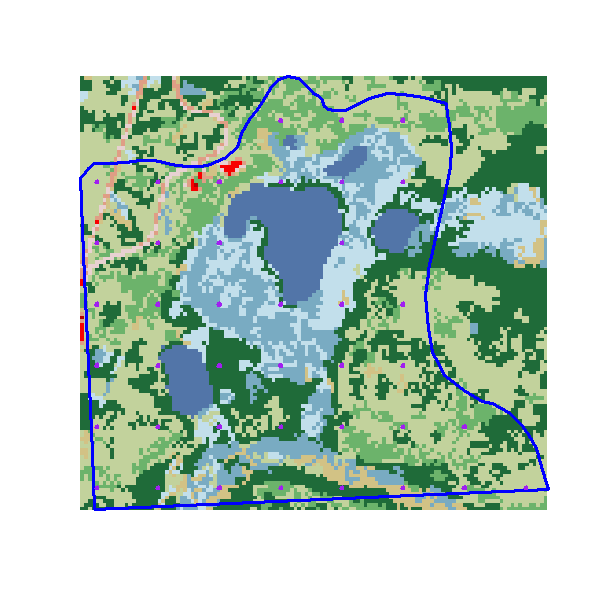
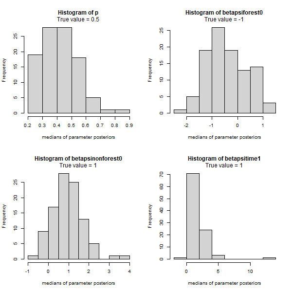
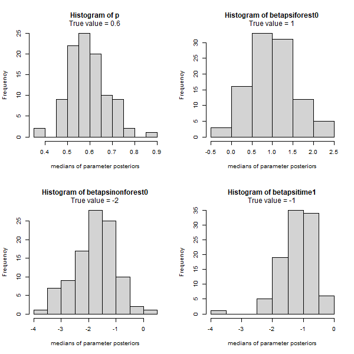
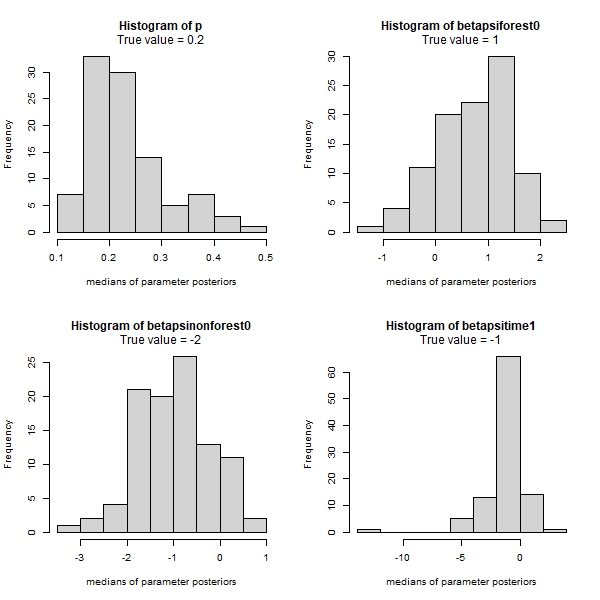

## Tuesday, December 29

I worked on simulations, this time using the NLCD 2016 classification as a covariate, dividing the study area into forest and nonforest.

```r
## Today I want to obtain NLCD 2016 land cover classes for the sites.

## Load libraries.
library(maptools)
library(rgdal)
library(raster)
library(rgeos)

## Load functions.
source("functions/functions.R")

## Load data.
load("../data/final_data/geodata/2020-12-16-1026_plot_circles.RData")

starea <- readOGR(dsn="../data/raw_data/geodata/study_area.kml")

proj4string(starea) == proj4string(plotsdf)

plotsab <- spTransform(plotsdf, CRS(albers))
starab <- spTransform(starea, CRS(albers))

## Now load NLCD.
## Downloaded from https://s3-us-west-2.amazonaws.com/mrlc/NLCD_2016_Land_Cover_AK_20200724.zip
nlcd <- raster("../source_data/NLCD_2016_Land_Cover_AK_20200724/NLCD_2016_Land_Cover_AK_20200724.img")
nlcdst <- crop(x=nlcd, y=extent(starab))
rm(nlcd)
## Saving this.
writeRaster(nlcdst, filename="../data/final_data/geodata/study_area_NLCD_2016.tif", format="GTiff")
nlcdst <- raster("../data/final_data/geodata/study_area_NLCD_2016.tif")

extract(x=nlcdst, y=plotsab)

## Zooming in to see an example of a plot that straddles multiple cover classes.
plot(plotsab[32,],
 xlim=c(extent(plotsab[32,])[1] - 60,
  extent(plotsab[32,])[2] + 60),
 ylim=c(extent(plotsab[32,])[3] - 60,
  extent(plotsab[32,])[4] + 60) 
 )
plot(nlcdst, add=TRUE)
plot(plotsab[32,],
 xlim=c(extent(plotsab[32,])[1] - 60,
  extent(plotsab[32,])[2] + 60),
 ylim=c(extent(plotsab[32,])[3] - 60,
  extent(plotsab[32,])[4] + 60), 
 add=TRUE
 )

nlcdl <- extract(x=nlcdst, y=plotsab)
unique(unlist(nlcdl))
[1] 43 42 41 95 90 52

forest <- 41:43
nonforest <- c(52, 90, 95)

nlcdm <- t(as.data.frame(nlcdl))
rownames(nlcdm) <- plotsdf@data$plot_name
nlcdm <- as.data.frame(nlcdm)
nlcdm$forest <- 0
nlcdm$nonforest <- 0
for (this_plot in 1:nrow(nlcdm))
 {
 if(any(nlcdm[this_plot,1:4] %in% forest))
  {
  nlcdm$forest[this_plot] <- 1
  }
 if(any(nlcdm[this_plot,1:4] %in% nonforest))
  {
  nlcdm$nonforest[this_plot] <- 1
  }
 }

## Save this.
write.csv(nlcdm, "../data/final_data/geodata/2020-12-29-0937_plots_nlcd_classes.csv")

## Should save a plot.
image_file <- paste0("../documents/images/", nowstring(), "_map_nlcd.png")
width <- 600
png(filename=image_file,
 width=width,
 height=round(width),
 pointsize=12
 )
plot(starab) 
plot(nlcdst, add=TRUE)
plot(starab, add=TRUE, border="blue", lwd=3)
plot(plotsab, add=TRUE, border="purple", lwd=4) 
dev.off()

## How many forest?
sum(nlcdm$forest)
[1] 30

sum(nlcdm$nonforest)
[1] 13

## so there must be three sites that straddle forest and nonforest?
sum(nlcdm$forest & nlcdm$nonforest)
[1] 3 ## Good.

## Now we can try some simulations with veg classes like our real data.

library(jagsUI)
library(MCMCglmm)

## Sweep net samples of terrestrial arthropods were collected in two sampling periods: from 14 to 17 June 2016 and from from 18 July to 9 August 2016
## I am going to simulate data similar to these date ranges.
s1 <- as.numeric(format(as.Date("2016-06-14"), format="%j"))
e1 <- as.numeric(format(as.Date("2016-06-17"), format="%j"))
s2 <- as.numeric(format(as.Date("2016-07-18"), format="%j"))
e2 <- as.numeric(format(as.Date("2016-08-09"), format="%j"))

## transformation
transtime <- function(x){
 (x - (s1+e2)/2)*2/(e2-s1)
 }

t1vals <- transtime(s1:e1) 
t2vals <- transtime(s2:e2) 
  
M <- 40 ## Number of sites.
T <- 2 ## Number of time periods.
J <- 2 ## Number of visits.
y <- matrix(NA, nrow=M, ncol=J)
simreps <- 100 ## Number of simulations per parameter combination.
#psi <- c(0.25, 0.5, 0.75) ## Values of psi to simulate.
p <- 0.5 ## Values of p to simulate.
betapsiforest0 <- -1   ## Simulating an organism uncommon in forest
betapsinonforest0 <- 1 ## and common in the nonforest.
betapsitime1 <- 1
nonforest <- nlcdm$nonforest
est <- array(dim=c(4, 8, simreps, length(betapsitime1), length(p)))
dimnames(est) <- list(
 variable=c("p", "betapsiforest0", "betapsinonforest0", "betapsitime1"),
 statistic=c(colnames(fm2$summary)[1:7], "mode"),
 simulation=1:simreps,
 beta=1:length(betapsitime1), ## These are just combinations of betas.
 p=p
 )


this_psi <- 1 ## These set values are for testing.
this_p <- 1
this_sim <- 1

et <- system.time(
for (this_psi in 1:length(betapsitime1))
 {
 for (this_p in 1:length(p))
  {
  for (this_sim in 1:simreps)
   {
   ## Counter.
   cat("beta", this_psi, "p", this_p, "simulation", this_sim[[1]])
   ## Dates.
   t1 <- sample(s1:e1, M, replace=TRUE)
   t2 <- sample(s2:e2, M, replace=TRUE)
   t1t <- transtime(t1)
   t2t <- transtime(t2)
   jdate <- cbind(t1t,t2t)
   #psi1 <- plogis(betapsi0[this_psi] + betapsitime1[this_psi]*t1t)
   #psi2 <- plogis(betapsi0[this_psi] + betapsitime1[this_psi]*t2t)
   ## Generate presence/absence data.
   ## Realizations of occurrence.
   z <- matrix(NA, nrow=M, ncol=2)
   for (this_plot in 1:M)
    {
	psi1 <- plogis(betapsiforest0[this_psi] + betapsinonforest0[this_psi]*nonforest[this_plot] + betapsitime1[this_psi]*t1t[this_plot])
	psi2 <- plogis(betapsiforest0[this_psi] + betapsinonforest0[this_psi]*nonforest[this_plot] + betapsitime1[this_psi]*t2t[this_plot])
	z[this_plot,1] <- rbinom(n=1, size=1, prob=psi1) 
    z[this_plot,2] <- rbinom(n=1, size=1, prob=psi2)
	}
   
   ## Generate detection/nondetection data.
   y <- array(NA, dim=c(M, T, J))   
   for (j in 1:2)
    {
	for (this_plot in 1:M)
	 {
     y[this_plot,1,j] <- rbinom(n=1, size=1, prob=z[this_plot,1]*p[this_p])
	 }
    } 
   for (j in 1:2)
    {
    for (this_plot in 1:M)
	 {
     y[this_plot,2,j] <- rbinom(n=1, size=1, prob=z[this_plot,2]*p[this_p])
	 }
    } 
   ## Insert NAs for sites sampled only once.
   y[,1,2][plotsdf$west_1==0] <- NA   
   y[,2,2][plotsdf$west_2==0] <- NA
   ## Now run model.
   str(win.data <- list(y=y, M=M, T=T, J=J, jdate=jdate, nonforest=nonforest))
   ## Initial values.
   zst <- apply(y, c(1,2), max, na.rm=TRUE)
   inits <- function(){list(z=zst)}
   ## Parameters monitored
   params <- c("p", "betapsiforest0", "betapsinonforest0", "betapsitime1")
   ## MCMC settings.
   ni <- 5000; nt <- 1; nb <- 1000; nc <- 1
   ## Call JAGS and summarize posteriors.
   fm2 <- jags(win.data,
    inits,
    params,
    "2020-12-29-0953_model.txt",
    n.chains=nc,
    n.thin=nt,
    n.iter=ni,
    n.burnin=nb
    )
   ## Save results.
   est[,1:7,this_sim,this_psi,this_p] <- fm2$summary[1:4,1:7]
   ## Calculate posterior modes.
   fmm <- mcmc(fm2$samples[[1]])
   est[,8,this_sim,this_psi,this_p] <- posterior.mode(fmm)[1:4]
   }
  }
 }
)
et

## Saving results.
save(est, file=paste0("../data/final_data/occupancy/", nowstring(), "_simulation_results.RData")) 

true_value <- c(p, betapsiforest0, betapsinonforest0, betapsitime1)
image_file <- paste0("../documents/images/", nowstring(), "_hists_posterior_medians.png")
width <- 600
png(filename=image_file,
 width=width,
 height=round(width),
 pointsize=12,
 antialias="cleartype"
 )
par(mfrow = c(2, 2))
for (this_param in 1:4)
 {
 hist(est[this_param,5,,1,1],
  main=paste0("Histogram of ", params[this_param]),
  xlab="medians of parameter posteriors"
  )
 mtext(paste0("True value = ", true_value[this_param]), cex=1.0, line=0.3)  
 }
dev.off() 
 

## Repeating with different parameter values.
M <- 40 ## Number of sites.
T <- 2 ## Number of time periods.
J <- 2 ## Number of visits.
y <- matrix(NA, nrow=M, ncol=J)
simreps <- 100 ## Number of simulations per parameter combination.
p <- 0.6 ## Values of p to simulate.
betapsiforest0 <- 1   ## Simulating an organism uncommon in forest
betapsinonforest0 <- -2 ## and common in the nonforest.
betapsitime1 <- -1
nonforest <- nlcdm$nonforest
est <- array(dim=c(4, 8, simreps, length(betapsitime1), length(p)))
dimnames(est) <- list(
 variable=c("p", "betapsiforest0", "betapsinonforest0", "betapsitime1"),
 statistic=c(colnames(fm2$summary)[1:7], "mode"),
 simulation=1:simreps,
 beta=1:length(betapsitime1), ## These are just combinations of betas.
 p=p
 )

et <- system.time(
for (this_psi in 1:length(betapsitime1))
 {
 for (this_p in 1:length(p))
  {
  for (this_sim in 1:simreps)
   {
   ## Counter.
   cat("beta", this_psi, "p", this_p, "simulation", this_sim[[1]])
   ## Dates.
   t1 <- sample(s1:e1, M, replace=TRUE)
   t2 <- sample(s2:e2, M, replace=TRUE)
   t1t <- transtime(t1)
   t2t <- transtime(t2)
   jdate <- cbind(t1t,t2t)
   #psi1 <- plogis(betapsi0[this_psi] + betapsitime1[this_psi]*t1t)
   #psi2 <- plogis(betapsi0[this_psi] + betapsitime1[this_psi]*t2t)
   ## Generate presence/absence data.
   ## Realizations of occurrence.
   z <- matrix(NA, nrow=M, ncol=2)
   for (this_plot in 1:M)
    {
	psi1 <- plogis(betapsiforest0[this_psi] + betapsinonforest0[this_psi]*nonforest[this_plot] + betapsitime1[this_psi]*t1t[this_plot])
	psi2 <- plogis(betapsiforest0[this_psi] + betapsinonforest0[this_psi]*nonforest[this_plot] + betapsitime1[this_psi]*t2t[this_plot])
	z[this_plot,1] <- rbinom(n=1, size=1, prob=psi1) 
    z[this_plot,2] <- rbinom(n=1, size=1, prob=psi2)
	}
   
   ## Generate detection/nondetection data.
   y <- array(NA, dim=c(M, T, J))   
   for (j in 1:2)
    {
	for (this_plot in 1:M)
	 {
     y[this_plot,1,j] <- rbinom(n=1, size=1, prob=z[this_plot,1]*p[this_p])
	 }
    } 
   for (j in 1:2)
    {
    for (this_plot in 1:M)
	 {
     y[this_plot,2,j] <- rbinom(n=1, size=1, prob=z[this_plot,2]*p[this_p])
	 }
    } 
   ## Insert NAs for sites sampled only once.
   y[,1,2][plotsdf$west_1==0] <- NA   
   y[,2,2][plotsdf$west_2==0] <- NA
   ## Now run model.
   str(win.data <- list(y=y, M=M, T=T, J=J, jdate=jdate, nonforest=nonforest))
   ## Initial values.
   zst <- apply(y, c(1,2), max, na.rm=TRUE)
   inits <- function(){list(z=zst)}
   ## Parameters monitored
   params <- c("p", "betapsiforest0", "betapsinonforest0", "betapsitime1")
   ## MCMC settings.
   ni <- 5000; nt <- 1; nb <- 1000; nc <- 1
   ## Call JAGS and summarize posteriors.
   fm2 <- jags(win.data,
    inits,
    params,
    "2020-12-29-0953_model.txt",
    n.chains=nc,
    n.thin=nt,
    n.iter=ni,
    n.burnin=nb
    )
   ## Save results.
   est[,1:7,this_sim,this_psi,this_p] <- fm2$summary[1:4,1:7]
   ## Calculate posterior modes.
   fmm <- mcmc(fm2$samples[[1]])
   est[,8,this_sim,this_psi,this_p] <- posterior.mode(fmm)[1:4]
   }
  }
 }
)
et

## Saving results.
save(est, file=paste0("../data/final_data/occupancy/", nowstring(), "_simulation_results.RData")) 

true_value <- c(p, betapsiforest0, betapsinonforest0, betapsitime1)
image_file <- paste0("../documents/images/", nowstring(), "_hists_posterior_medians.png")
width <- 600
png(filename=image_file,
 width=width,
 height=round(width),
 pointsize=12,
 antialias="cleartype"
 )
par(mfrow = c(2, 2))
for (this_param in 1:4)
 {
 hist(est[this_param,5,,1,1],
  main=paste0("Histogram of ", params[this_param]),
  xlab="medians of parameter posteriors"
  )
 mtext(paste0("True value = ", true_value[this_param]), cex=1.0, line=0.3)  
 }
dev.off() 
 
## Those appeared to work pretty well.

## Let's try dropping probability of detection, which should mess things up more.
M <- 40 ## Number of sites.
T <- 2 ## Number of time periods.
J <- 2 ## Number of visits.
y <- matrix(NA, nrow=M, ncol=J)
simreps <- 100 ## Number of simulations per parameter combination.
p <- 0.2 ## Values of p to simulate.
betapsiforest0 <- 1   ## Simulating an organism uncommon in forest
betapsinonforest0 <- -2 ## and common in the nonforest.
betapsitime1 <- -1
nonforest <- nlcdm$nonforest
est <- array(dim=c(4, 8, simreps, length(betapsitime1), length(p)))
dimnames(est) <- list(
 variable=c("p", "betapsiforest0", "betapsinonforest0", "betapsitime1"),
 statistic=c(colnames(fm2$summary)[1:7], "mode"),
 simulation=1:simreps,
 beta=1:length(betapsitime1), ## These are just combinations of betas.
 p=p
 )

et <- system.time(
for (this_psi in 1:length(betapsitime1))
 {
 for (this_p in 1:length(p))
  {
  for (this_sim in 1:simreps)
   {
   ## Counter.
   cat("beta", this_psi, "p", this_p, "simulation", this_sim[[1]])
   ## Dates.
   t1 <- sample(s1:e1, M, replace=TRUE)
   t2 <- sample(s2:e2, M, replace=TRUE)
   t1t <- transtime(t1)
   t2t <- transtime(t2)
   jdate <- cbind(t1t,t2t)
   #psi1 <- plogis(betapsi0[this_psi] + betapsitime1[this_psi]*t1t)
   #psi2 <- plogis(betapsi0[this_psi] + betapsitime1[this_psi]*t2t)
   ## Generate presence/absence data.
   ## Realizations of occurrence.
   z <- matrix(NA, nrow=M, ncol=2)
   for (this_plot in 1:M)
    {
	psi1 <- plogis(betapsiforest0[this_psi] + betapsinonforest0[this_psi]*nonforest[this_plot] + betapsitime1[this_psi]*t1t[this_plot])
	psi2 <- plogis(betapsiforest0[this_psi] + betapsinonforest0[this_psi]*nonforest[this_plot] + betapsitime1[this_psi]*t2t[this_plot])
	z[this_plot,1] <- rbinom(n=1, size=1, prob=psi1) 
    z[this_plot,2] <- rbinom(n=1, size=1, prob=psi2)
	}
   
   ## Generate detection/nondetection data.
   y <- array(NA, dim=c(M, T, J))   
   for (j in 1:2)
    {
	for (this_plot in 1:M)
	 {
     y[this_plot,1,j] <- rbinom(n=1, size=1, prob=z[this_plot,1]*p[this_p])
	 }
    } 
   for (j in 1:2)
    {
    for (this_plot in 1:M)
	 {
     y[this_plot,2,j] <- rbinom(n=1, size=1, prob=z[this_plot,2]*p[this_p])
	 }
    } 
   ## Insert NAs for sites sampled only once.
   y[,1,2][plotsdf$west_1==0] <- NA   
   y[,2,2][plotsdf$west_2==0] <- NA
   ## Now run model.
   str(win.data <- list(y=y, M=M, T=T, J=J, jdate=jdate, nonforest=nonforest))
   ## Initial values.
   zst <- apply(y, c(1,2), max, na.rm=TRUE)
   inits <- function(){list(z=zst)}
   ## Parameters monitored
   params <- c("p", "betapsiforest0", "betapsinonforest0", "betapsitime1")
   ## MCMC settings.
   ni <- 5000; nt <- 1; nb <- 1000; nc <- 1
   ## Call JAGS and summarize posteriors.
   fm2 <- jags(win.data,
    inits,
    params,
    "2020-12-29-0953_model.txt",
    n.chains=nc,
    n.thin=nt,
    n.iter=ni,
    n.burnin=nb
    )
   ## Save results.
   est[,1:7,this_sim,this_psi,this_p] <- fm2$summary[1:4,1:7]
   ## Calculate posterior modes.
   fmm <- mcmc(fm2$samples[[1]])
   est[,8,this_sim,this_psi,this_p] <- posterior.mode(fmm)[1:4]
   }
  }
 }
)
et

## Saving results.
save(est, file=paste0("../data/final_data/occupancy/", nowstring(), "_simulation_results.RData")) 

true_value <- c(p, betapsiforest0, betapsinonforest0, betapsitime1)
image_file <- paste0("../documents/images/", nowstring(), "_hists_posterior_medians.png")
width <- 600
png(filename=image_file,
 width=width,
 height=round(width),
 pointsize=12,
 antialias="cleartype"
 )
par(mfrow = c(2, 2))
for (this_param in 1:4)
 {
 hist(est[this_param,5,,1,1],
  main=paste0("Histogram of ", params[this_param]),
  xlab="medians of parameter posteriors"
  )
 mtext(paste0("True value = ", true_value[this_param]), cex=1.0, line=0.3)  
 }
dev.off()  
``` 

```
model {

# Priors
 mean.psi.forest ~ dunif(0,1)
 mean.psi.nonforest ~ dunif(0,1)
 betapsiforest0 <- logit(mean.psi.forest)
 betapsinonforest0 <- logit(mean.psi.nonforest)
 betapsitime1 ~ dunif(-20,20)
 p ~ dunif(0,1)
 
# Likelihood
for (i in 1:M) 
 {
 for (t in 1:T)
  {
  logit(psi[i,t]) <- betapsiforest0 + betapsinonforest0*nonforest[i] + betapsitime1*jdate[i,t]
  z[i,t] ~ dbern(psi[i,t])
  for (j in 1:J) 
   {
   y[i,t,j] ~ dbern(z[i,t]*p)
   }
  }
 } 
}

```

\
Map of the study area with the NLCD 2016 land cover classification as the background, the study area boundary in blue, and the plots in purple.

\
Histograms of medians of posterior distributions of parameters from 100 simulations.

\
Histograms of medians of posterior distributions of parameters from 100 simulations.

\
Histograms of medians of posterior distributions of parameters from 100 simulations.
