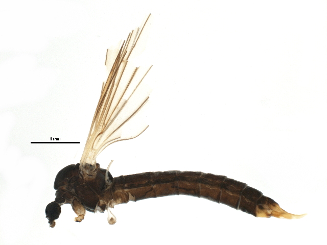

## Thursday, December 31

I reviewed and edited the biological assessment for the land exchange.

I am attempting to key a pair of tipuloid fly larvae that I collected yesterday using the key of @sundermann_key_2007, p. 72, Limoniidae/Pediciidae. 1 → 2 → 3 → 4 → *Dicranota*?

Based on a GBIF search, Pediciidae in our area include 	
*Dicranota cayuga* (Alexander, 1916), *Dicranota maculata* (Doane, 1900), *Ornithodes harrimani* Coquillett, 1900, *Pedicia frigida* (Alexander, 1919), *Tricyphona glacialis* Alexander, 1917 and *Tricyphona hannai* Alexander, 1923. My specimens have paired pseudopodia with hooks on the apical end of each pseudopodium, which means that they are not *Pedicia* or *Tricyphona*. According to @alexander_tipulidae_1983, larvae of *Ornithodes* are unknown.

No DNA sequence of anything identified as genus *Ornithodes* exists in NCBI GenBank or BOLD.

The sequence I obtained earlier was a short read (388 bp), but it was a 100% match for members of BIN [BOLD:ACR8073](http://boldsystems.org/index.php/Public_BarcodeCluster?clusteruri=BOLD:ACR8073), e.g. specimen [CNKLB3574-14](http://boldsystems.org/index.php/Public_RecordView?processid=CNKLB3574-14).

The image representing this BIN (below) a short rostrum, so it is not *Ornithodes*. It must be *Dicranota*.

\
Photograph of specimen [CNKLB072-14](http://boldsystems.org/index.php/Public_RecordView?processid=CNKLB072-14), a member of BIN [BOLD:ACR8073](http://boldsystems.org/index.php/Public_BarcodeCluster?clusteruri=BOLD:ACR8073). Image CC-0 by CBG Photography Group, Centre for Biodiversity Genomics, downloaded from <http://boldsystems.org/pics/CNKLB/BIOUG17221-H01%2B1424887294.jpg>.

Interestingly, there are 27 BINs identified as *Dicranota* on BOLD, but none of them are close to the sequences from my specimen or BIN BOLD:ACR8073.

Larvae of *Dicranota* are carnivorous and can be found in "wet soil along streams, in boggy areas, and in other comparable places" according to @alexander_crane_1967.

